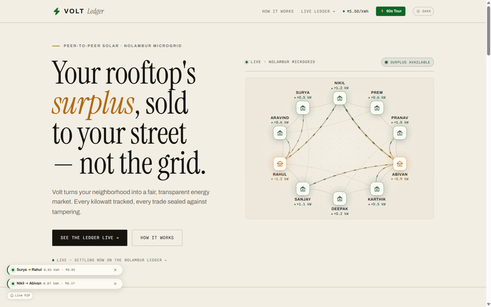
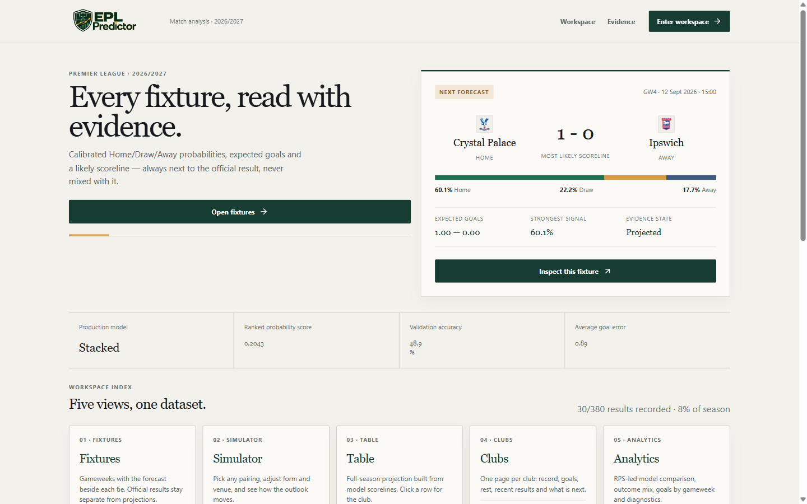
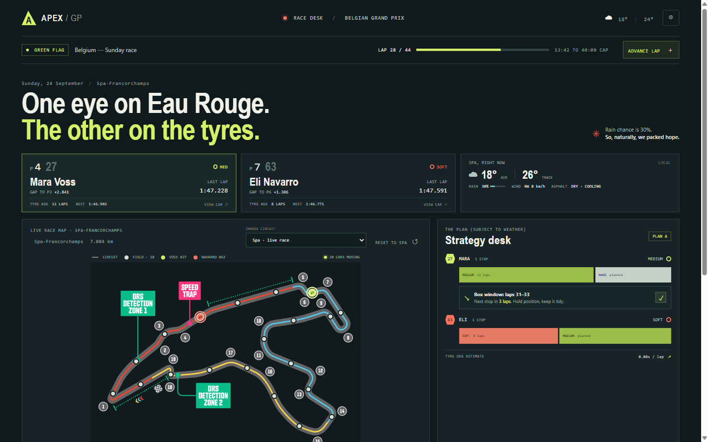

# Raghav Krishna

Robotics and web in Chennai. ESP32 hardware, ML pipelines, deployed apps. I lead a two-person team.

**[raghavkrishna-dev.vercel.app](https://raghavkrishna-dev.vercel.app)**

## Competitions

| Project | Event | Result |
| :--- | :--- | :--- |
| **Vault** | PEC Hacks 4.0 | **Won** |
| **CRASH** | ZRC Technoxian 2026 | **Top 5**, qualified for NRC (Delhi) |
| **Volt** | Shark Tank Challenge 2026 | Participated |

## Live

| Volt | EPL Predictor | Apex GP |
| :--- | :--- | :--- |
|  |  |  |

## Team projects

| Project | What it does | Badges |
| :--- | :--- | :--- |
| [Volt](https://github.com/abivan100-stack/volt-ledger) | Peer-to-peer rooftop solar ledger, SHA-256 chained in the browser |  [] |
| [Vault](https://github.com/abivan100-stack/vault) | Vaccine cold chain ledger with verifiable entries | [] |
| [CRASH](https://github.com/abivan100-stack/C.R.A.S.H) | Ranks Chennai's deadliest junctions and proposes interventions | [] |
| [Apex GP](https://github.com/Raghav2012Code/f1-team-dashboard) | F1 race strategy desk for Spa, 20-car live field |  |

## Solo

| Project | What it does | Badges |
| :--- | :--- | :--- |
| [EPL Predictor](https://github.com/Raghav2012Code/epl-predictor) | Calibrated match forecasts, production picked by RPS |  [] [] [CI](https://github.com/Raghav2012Code/epl-predictor/actions) |
| [Urbania](https://github.com/Raghav2012Code/urbania) | 2D city simulation in C++ and raylib | [] [] |
| [Diecastly](https://github.com/Raghav2012Code/diecastly) | Inventory and point of sale for a real collectibles seller | [] [] |

## More

[dev-portfolio](https://github.com/Raghav2012Code/dev-portfolio), [ariadne-](https://github.com/Raghav2012Code/ariadne-), [brew-and-co](https://github.com/Raghav2012Code/brew-and-co), [productivity-hub](https://github.com/Raghav2012Code/productivity-hub), [kanban](https://github.com/Raghav2012Code/kanban), [sort-pulse](https://github.com/Raghav2012Code/sort-pulse), [lebron-fan-page](https://github.com/Raghav2012Code/lebron-fan-page)

## Contact

[@Raghav2012Code](https://github.com/Raghav2012Code), [raghavgamerz670@gmail.com](mailto:raghavgamerz670@gmail.com)
