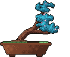

# Raghav Krishna

I'm a 14-year-old freshman (Class 9) in Chennai, and I lead my school's robotics team. I build ESP32 hardware, ML pipelines, and deployed web apps. I pair with coding agents to ship faster, and I own everything that touches the hardware.

## Stack

a tree of my commits, grown with <a href="https://github.com/egorthinks/git-bonsai">git-bonsai</a>

<picture></picture><!-- bonsai: pin WIDTH, never height. git-bonsai trees change aspect ratio with style
     (formal 92x109 tall vs slanted 118x96 wide); pinning height stretched the slanted
     tree to 288px and collapsed the badge grid to one badge per row.
     <picture> is also required: GitHub injects height:auto on bare .
     The   below the grid keeps later sections under the float. -->
<picture></picture>

                    

 

## Competitions

| Event | Project | Result |
| :--- | :--- | :--- |
| RIRC 2026 | **HingeGuard** | **Won** |
| PEC Hacks 4.0 | [**Vault**](https://github.com/abivan100-stack/vault) | **Won** |
| ZRC Technoxian 2026 | [**CRASH**](https://github.com/abivan100-stack/C.R.A.S.H) | **Top 5**, qualified for NRC (Noida) |
| Shark Tank Challenge 2026 | [**Volt**](https://github.com/abivan100-stack/volt-ledger) | Participated |

## Projects

| Project | What it does | Built |
| :--- | :--- | :--- |
| [Volt](https://github.com/abivan100-stack/volt-ledger) | Peer-to-peer rooftop solar ledger, SHA-256 chained in the browser | Aug 2026 |
| [Vault](https://github.com/abivan100-stack/vault) | Vaccine cold chain ledger with verifiable entries | Aug 2026 |
| [CRASH](https://github.com/abivan100-stack/C.R.A.S.H) | Ranks Chennai's deadliest junctions and proposes interventions | Jul 2026 |
| [EPL Predictor](https://github.com/Raghav2012Code/epl-predictor) | Calibrated match forecasts, production picked by RPS | Sep 2026 |

